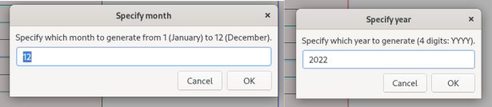
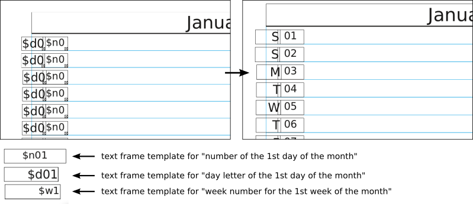
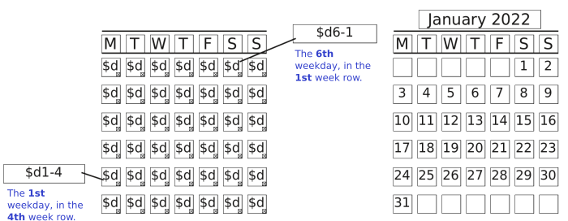

# Scribus Calendar Tools
Creating calendars is a lot of manual work - the scripts in this repository attempts to automate some of this work for you. Unlike other calendar scripts for Scribus, these scripts don't generate or assume specific layouts or designs. Instead, they insert correct week letters and date numbers based on  a template created by the user.

# Month Calendar
The month calendar reads a selection on a page and converts template text frames to the correct day of month, based on user choice.

It currently supports three templates:
 * `$n` which is translated to a number representation of a given date. Fx `$n04` 
 * `$d` which is translated to a day letter of a given date (MTWTFSS). Fx `$d01`
 * `$w` which is translated to a week number (the number being the order). Fx `$w3`  

How to use:
 1. Download this repository as a zip and unpack it.
 1. (Optional) Go to _File_ -> _Import_ -> _Get Vector File.._ and choose `monthlist.sce` to import a ready-made template. Alternatively, use it to create your own layout. 
 1. Create a box selection which includes all the text templates.
 1. Go to _Scripts_ -> _Execute Script_ and choose `MonthCalendarOnCurrentPage.py`
 1. Specify the month and year you wish to generate.

# Year Calendar
The year calendar reads a selection on a page and converts a grid of 7 x 6 template text frames to the correct day of month, based on a template which consists of a day of week + the occurence of the day (a typical year calendar format, see image). 

It currently supports one template:
 * `$dx-x`. The first number is the weekday number (Monday: 1, Sunday:7). The second number is the week order (row number in a sense). Fx`$d1-4` refers to the 4th Monday in a month. If the number does not resolve to a valid date, the text frame is set as empty.

How to use:
 1. Download this repository as a zip and unpack it.
 1. (Optional) Go to _File_ -> _Import_ -> _Get Vector File.._ and choose `yearcalendar.sce` to import a ready-made template. Alternatively, use it or modify it to create your own layout.
 1. Create a box selection which includes all the text templates.
 1. Go to _Scripts_ -> _Execute Script_ and choose `YearCalendarOnCurrentPage.py`
 1. Specify the month and year you wish to generate.

Licensed under GPL 3.0

